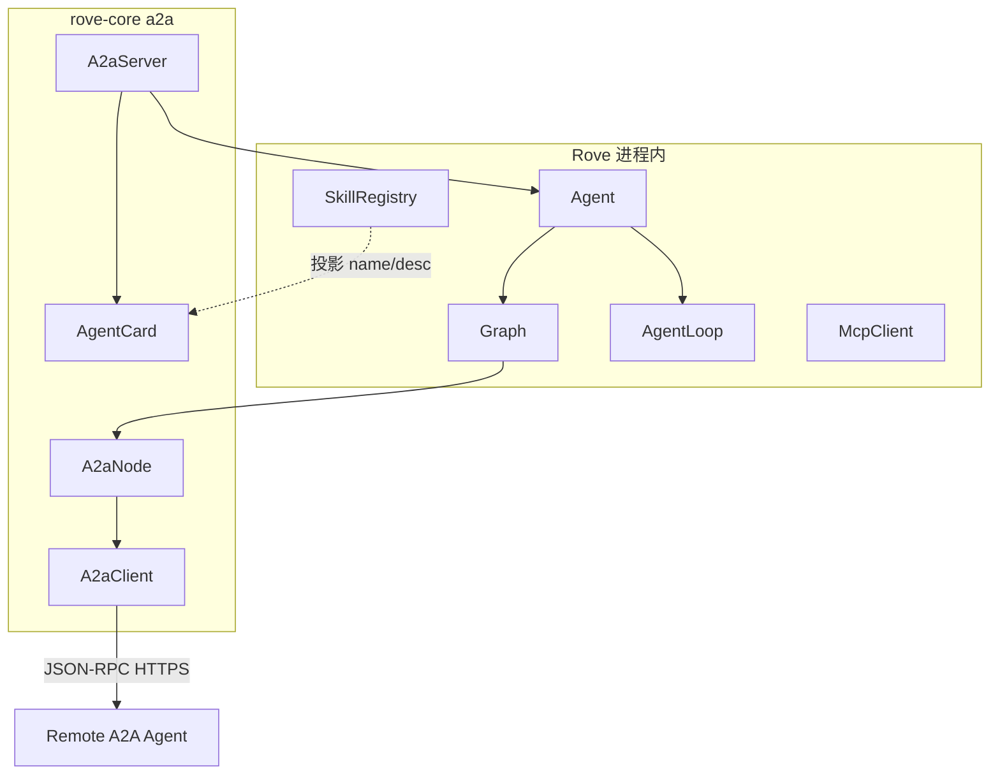

# Rove × A2A Protocol（v1.0.0）— 存档

> 完整参考官方规范：[A2A Protocol v1.0.0](https://a2a-protocol.org/v1.0.0/)  
> **本版范围：不做 A2A（实现与类型定义都不做）。** 本文仅作后续规划存档。
>
> **本版正文请从 [README.md](./README.md) 进入**：  
> · [agent-graph-design.md](./agent-graph-design.md)  
> · [runtime.md](./runtime.md)  
> · [agent-loop.md](./agent-loop.md)

---

## 1. A2A 是什么（相对 Rove 的位置）

A2A（Agent2Agent）是 **Agent ↔ Agent** 的互操作协议：不同框架/厂商的 Agent 可以互相发现、委派任务、交换多模态内容，且 **不暴露** 对方内部 memory / tools / 推理过程（Opaque Execution）。

```text
用户
  └─► Rove Agent（本地：Graph / AgentLoop / Skill / MCP）
         └─► A2A Client ──HTTP/JSON-RPC/gRPC──► 远端 A2A Server（Remote Agent）
         ▲                                              │
         └──────── 也可作为 A2A Server 被别人调用 ◄──────┘
```

| 协议 | 解决什么 | Rove 内对应 |
| --- | --- | --- |
| **MCP** | Agent ↔ Tool/数据源 | `McpClient` / `Tool` / `SkillNode` |
| **A2A** | Agent ↔ Agent | **新增**：`A2aClient` / `A2aServer` / 可选 `A2aNode` |
| **LLM Chat Completions** | Agent ↔ 模型 | `LlmClient` / `Message(role=system\|user\|assistant\|tool)` |

官方表述：不要把远端 Agent 简单「封装成一个 Tool」——会削掉协商、多轮、长任务能力。Rove 里应把远端能力建模为 **A2A Task/Message**，而不是塞进 OpenAI `tools[]`（除非做很薄的适配，且文档标明损失）。

---

## 2. 规范三层结构（必须对齐）

来自 [Specification §1.3](https://a2a-protocol.org/v1.0.0/specification/)：

| 层 | 内容 | Rove 映射建议 |
| --- | --- | --- |
| **L1 Data Model** | `Task` / `Message` / `AgentCard` / `Part` / `Artifact` / `Extension` | `com.gsralex.rove.core.a2a.*` 独立包，**不要**与 LLM `Message` 混成一个类 |
| **L2 Operations** | Send/Stream Message、Get/List/Cancel Task、Subscribe、Push Config、GetExtendedAgentCard | `A2aClient` 方法；Server 侧 handler |
| **L3 Bindings** | JSON-RPC、gRPC、HTTP+JSON/REST | **第一版优先 JSON-RPC over HTTPS**（简单、与官方教程一致）；gRPC/REST 后续 |

---

## 3. 核心角色

| 角色 | 含义 |
| --- | --- |
| **User** | 人类或上游系统 |
| **A2A Client（Client Agent）** | 代表用户发起请求的一方（Rove 常扮演） |
| **A2A Server（Remote Agent）** | 暴露 A2A 端点的不透明 Agent（Rove 也可扮演） |

生命周期概览（官方）：

1. **Discovery**：`GET /.well-known/agent-card`（或文档约定的 Agent Card URL）  
2. **Auth**：按 Card 中 `securitySchemes` / `securityRequirements` 取凭证（通常走 **HTTP Header**，不塞进 A2A body）  
3. **SendMessage** / **SendStreamingMessage**  
4. 长任务：**GetTask** 轮询 / **Subscribe** SSE / **Push Notifications**

---

## 4. 数据模型（L1）摘要

> 字段以官方 Spec §4 为准；实现时从 proto 生成或严格手写对齐。下列为 Rove 文档用摘要。

### 4.1 AgentCard（发现用「名片」）

必填概念：`name`、`description`、`version`、`supportedInterfaces`、`capabilities`、`defaultInputModes`、`defaultOutputModes`、`skills[]`。

| 字段（摘要） | 用途 |
| --- | --- |
| `supportedInterfaces[]` | `url` + `protocolBinding`（`JSONRPC`/`GRPC`/`HTTP+JSON`）+ `protocolVersion`（如 `"1.0"`） |
| `capabilities` | `streaming` / `pushNotifications` / `extendedAgentCard` / `extensions` |
| `skills` | `AgentSkill`：对外宣称的能力描述（**描述性**，不是 MCP tool schema） |
| `securitySchemes` / `securityRequirements` | 如何认证 |

`AgentSkill` 关键字段：`id`、`name`、`description`、`tags`、可选 `examples`、`inputModes`/`outputModes`。

与 Rove `Skill`（`SKILL.md`）关系：

| | A2A `AgentSkill` | Rove `Skill`（SKILL.md） |
| --- | --- | --- |
| 受众 | **其他 Agent / 客户端** | **本机 Agent 执行** |
| 内容 | 名片上的能力广告 | 渐进披露的执行说明 / MCP 指向 |
| 加载 | 随 AgentCard 发布 | 先 name，执行时再读 md |

可将本机 `SkillRegistry` 的 name+description **投影**到 AgentCard.skills；**不要**把 SKILL.md 正文整份塞进 Card。

### 4.2 Task（工作单元，有状态）

| 字段 | 说明 |
| --- | --- |
| `id` | 任务唯一 ID |
| `contextId` | 可选；归组相关 Task/Message |
| `status` | `TaskStatus`（含 `TaskState` + 可选 message/timestamp） |
| `artifacts` | 任务产出 |
| `history` 等 | 依 Spec / GetTask 参数 |

**TaskState**（规范枚举概念）：

| State | 含义 |
| --- | --- |
| `SUBMITTED` | 已受理 |
| `WORKING` | 处理中 |
| `COMPLETED` | 成功终态 |
| `FAILED` | 失败终态 |
| `CANCELED` | 取消终态 |
| `REJECTED` | 拒绝终态 |
| `INPUT_REQUIRED` | 需更多输入（中断态） |
| `AUTH_REQUIRED` | 需认证（中断态） |

终端态 Task **不得**再接受继续发消息（否则 `UnsupportedOperationError`）。

### 4.3 Message（A2A 对话轮次）— 勿与 LLM Message 混淆

| | **A2A Message** | **Rove LLM `Message`** |
| --- | --- | --- |
| role | `USER` / `AGENT` | `SYSTEM` / `USER` / `ASSISTANT` / `TOOL` |
| 内容 | `parts[]`（多模态） | 主要是 `content` + 可选 `toolCalls` |
| ID | 必有 `messageId`；可有 `contextId`/`taskId` | 无协议级 messageId |

**映射原则（Rove 内部）：**

- 进模型前：A2A `Part(text)` → LLM `Message.user/assistant` 文本；结构化 `Part(data)` → JSON 字符串或 tool 结果。  
- 出站：LLM 最终答复 → A2A `Message(role=AGENT, parts=[text…])`；文件/表 → `Artifact`。  
- **禁止**把 LLM 的 `tool` role 直接当成 A2A Message role。

### 4.4 Part

`Part` **必须恰好一种**：`text` | `raw`(bytes/base64) | `url` | `data`(JSON)。  
可有 `mediaType` / `filename` / `metadata`。

### 4.5 Artifact

任务的**可交付产出**（文档、图、结构化结果），含 `artifactId`、`parts[]`。  
规范强调：任务结果应优先走 **Artifact**，不要把大结果只塞在聊天 Message 里。

### 4.6 事件

- `TaskStatusUpdateEvent`：状态变更  
- `TaskArtifactUpdateEvent`：产物增量（`append` / `lastChunk`）

---

## 5. 抽象操作（L2）与 Binding 方法名（L3）

来自 Spec §3 + §5.3 Method Mapping：

| 功能 | JSON-RPC Method | REST（参考） |
| --- | --- | --- |
| Send message | `SendMessage` | `POST /message:send` |
| Stream message | `SendStreamingMessage` | `POST /message:stream` |
| Get task | `GetTask` | `GET /tasks/{id}` |
| List tasks | `ListTasks` | `GET /tasks` |
| Cancel task | `CancelTask` | `POST /tasks/{id}:cancel` |
| Subscribe to task | `SubscribeToTask` | `POST /tasks/{id}:subscribe` |
| Create push config | `CreateTaskPushNotificationConfig` | `POST /tasks/{id}/pushNotificationConfigs` |
| Get push config | `GetTaskPushNotificationConfig` | … |
| List push configs | `ListTaskPushNotificationConfigs` | … |
| Delete push config | `DeleteTaskPushNotificationConfig` | … |
| Extended Agent Card | `GetExtendedAgentCard` | `GET /extendedAgentCard` |

**SendMessage** 行为要点：

- 入参：`SendMessageRequest`（message + configuration + metadata）  
- 出参：**`Task` 或直接 `Message`**（简单交互可不建 Task）  
- 可 `return_immediately`：先返回 in-progress Task，再轮询/订阅  

**Streaming**：需 `capabilities.streaming=true`；SSE 推送 Task / StatusUpdate / ArtifactUpdate，至终态关流。

**Push**：需 `capabilities.pushNotifications=true`；Webhook POST，payload 与 Stream 事件同形。

### A2A 专用错误码（JSON-RPC 映射摘要）

| Error | Code |
| --- | --- |
| `TaskNotFoundError` | `-32001` |
| `TaskNotCancelableError` | `-32002` |
| `PushNotificationNotSupportedError` | `-32003` |
| `UnsupportedOperationError` | `-32004` |
| `ContentTypeNotSupportedError` | `-32005` |
| `InvalidAgentResponseError` | `-32006` |
| `ExtendedAgentCardNotConfiguredError` | `-32007` |
| `ExtensionSupportRequiredError` | `-32008` |
| `VersionNotSupportedError` | `-32009` |

Capability 未声明却调用对应能力 → 必须返回上述错误（Spec §3.3.4）。

---

## 6. Rove 集成形态（设计）



### 6.1 作为 Client（调用远端 Agent）

建议类型：

```java
// 示例
public interface A2aClient {
    AgentCard getAgentCard(URI cardUrl);           // 或 well-known
    Object sendMessage(SendMessageRequest req);  // Task | Message
    // stream / getTask / cancel / list / pushConfigs / getExtendedCard …
}
```

**Graph 节点：`A2aNode`（固定编排里委派远端）**

- 与 `SkillNode` 类似：开发者钉死「调用哪个远端 + 期望的 skill/提示」  
- 不把远端 Agent 伪装成 LLM `tools[]` 里的 function（避免 Opaque/多轮能力丢失）  
- 状态机：发送 → 若返回 Task 则轮询/订阅至终态 → 把 Artifact/最终 Message 写入 Graph state  

**AgentLoop 调其他 Agent**：能力名单里可放 **A2A 委派 Tool**（实现 `Tool`，内部 `A2aClient`）。与 Graph 的 `A2aNode`（编排钉死远端）互补——一个是模型选，一个是开发者选。详见 [agent-loop.md](./agent-loop.md)。

### 6.2 作为 Server（对外暴露本机 Agent）

- 发布 `AgentCard`（含 `supportedInterfaces`、`skills` 投影、capabilities）  
- JSON-RPC 实现 `SendMessage` 等  
- 入站 A2A Message → 转换为内部 `agent.run(...)`  
- 长任务：创建内部 Task 记录，状态映射到 `TaskState`；产出写入 `Artifact`  
- Filter/Listener：Server 边界可挂认证与审计（与 [runtime.md](./runtime.md) 一致）

### 6.3 与订票 Graph 示例的关系

本地固定流水线仍用 `LlmNode` + `SkillNode`。  
若「验票」由外部航司 Agent 提供：用 **`A2aNode`** 调远端 `SendMessage`，而不是 MCP `flights.verify`（除非对方只提供 MCP）。

旅行规划总控 Agent（官方场景）≈ Rove `Agent` + Graph/AgentLoop，子 Agent 全部走 A2A。

---

## 7. 命名隔离（非常重要）

| 概念 | 包建议 | 备注 |
| --- | --- | --- |
| LLM Message | `core.common.Message` | Chat Completions |
| A2A Message | `core.a2a.A2aMessage` | role=USER/AGENT + parts |
| LLM Tool / ToolCall | `core.tool.*` | function calling |
| A2A AgentSkill | `core.a2a.AgentSkill` | Card 上的技能广告 |
| Rove Skill | `core.skills.Skill` | SKILL.md |
| A2A Task | `core.a2a.Task` | 勿与业务「todo」混淆 |

文档与代码中一律加 `A2a` 前缀或独立包，避免「Message」一词三义。

---

## 8. 范围（A2A 后续）

### 做

1. 数据模型：AgentCard（只读解析）、A2aMessage/Part、Task/TaskStatus/TaskState、Artifact（最小集）  
2. **JSON-RPC Client**：`getAgentCard`（HTTP GET well-known 或配置 URL）+ `SendMessage` + `GetTask` + `CancelTask`  
3. **`A2aNode`**：Graph 内同步等待 Task 完成（轮询 GetTask）  
4. Card.skills ← 可选从本地 SkillRegistry **投影** name/description  

### 暂缓

- SendStreamingMessage / Subscribe SSE  
- Push Notification 全套  
- GetExtendedAgentCard  
- gRPC / REST binding  
- 完整 A2aServer（可第二期：先 Client 能调别人）  
- Agent Card JWS 签名校验（可先忽略 `signatures`）

### 明确不做

- 把任意 Remote Agent 默认注册进 `AgentLoop` 的 `tools[]` 全量列表  
- 用 A2A Message 替换 LLM Message  

---

## 9. 安全与 Opaque（规范原则）

- 传输：生产环境 **HTTPS**  
- 认证：按 AgentCard 声明；凭证在 **HTTP 头**，不进 JSON-RPC params 里的业务 Message（除非扩展明确规定）  
- Opaque：只交换 Card 声明的能力与 Message/Artifact；不索取对方工具实现、prompt、记忆  
- Capability Validation：未声明 streaming/push 却调用 → 规范错误码  

与 Rove Filter 关系：出站 A2aClient 调用前可 `beforeTool` 式门禁（或专用 `beforeA2aSend`）；Listener 记录 taskId/状态便于审计。

---

## 10. 文档索引

| 文档 | 内容 | 本版 |
| --- | --- | --- |
| [README.md](./README.md) | 总目录与阅读顺序 | — |
| [agent-graph-design.md](./agent-graph-design.md) | 本地 Graph / Skill / 边界类型 | ✅ |
| [runtime.md](./runtime.md) | Filter / Listener / Graph vs Loop | ✅ |
| [agent-loop.md](./agent-loop.md) | 开放规划（AgentLoop）；本版不含 A2A 委派 | ✅ |
| [a2a.md](./a2a.md) | Agent↔Agent 协议与 Rove 映射（本文） | 📦 存档 |

官方外链：

- https://a2a-protocol.org/v1.0.0/  
- https://a2a-protocol.org/v1.0.0/specification/  
- https://a2a-protocol.org/v1.0.0/topics/key-concepts/  
- https://a2a-protocol.org/v1.0.0/topics/what-is-a2a/  

---

## 11. 未决（A2A 后续再议）

本版不做 A2A，下列问题不阻塞当前开发：

1. 是否只做 A2A Client + A2aNode，Server 放到下一期？  
2. Binding **只做 JSON-RPC** 是否可接受？  
3. `A2aNode` 等待策略：仅轮询，还是上 SSE stream？  
4. AgentCard 发布路径：静态文件 `/.well-known/agent-card` 是否由 `rove-console` 提供？
