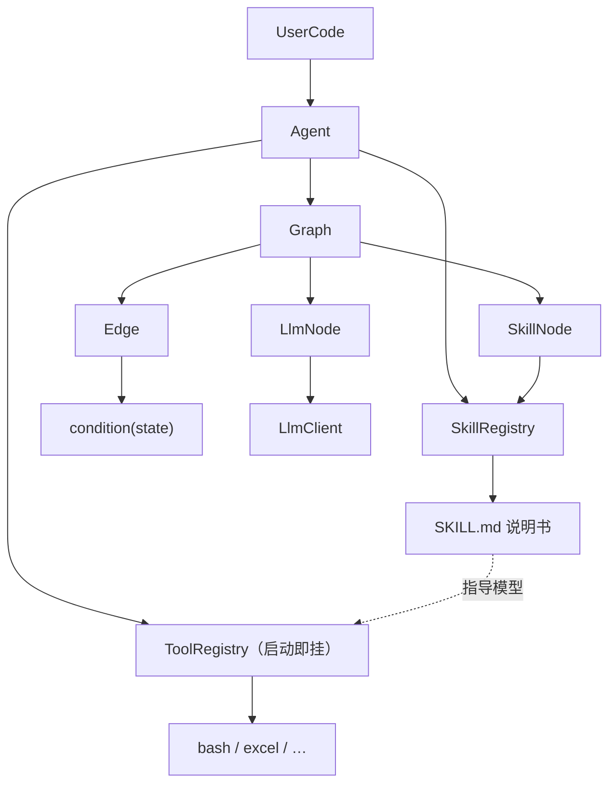
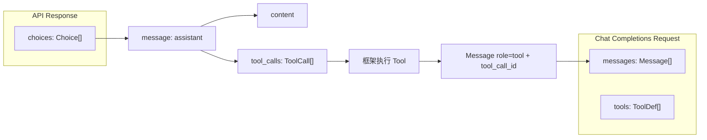

# Rove Agent / Graph

> 目标：固定编排为主；开放规划走 AgentLoop。**Skill / MCP 按需**；**Tool 用户定义**（LLM 见 name）。Skill 是说明书；执行靠已挂载的 Tool。
>
> **相关文档**（阅读顺序见 [README.md](./README.md)）  
> · [runtime.md](./runtime.md) — 运行时 / Filter / Listener  
> · [agent-loop.md](./agent-loop.md) — 开放规划 AgentLoop  
> · [a2a.md](./a2a.md) — A2A（本版存档，不做）

## 核心判断

| 之前方案问题 | 你要的 |
| --- | --- |
| `Loop` 让 LLM 自己选 tool | 步骤与 skill 由开发者钉死 |
| 把本 Agent 的开放 Loop 伪装成 Node | 本图用 `AgentLoopNode`；**另一个** Agent 用 `AgentNode`（经 `LoopManager` 虚拟线程池） |
| Graph 只是可选编排 | **Graph 是主路径**；Agent 是挂载 Graph 的入口 |
| 代码里手写 `Tool checkTickets = ...` | 能力写在 `SKILL.md`，由 Node **动态加载** |

开放规划（AgentLoop）与固定 Graph **并存**：订票这类流水线走 Graph；探索性任务走 AgentLoop。

## 三层概念



1. **Agent**：面向用户的入口（配置 LLM、挂 Graph、Skill 安装范围、`run`）
2. **Graph**：固定编排的 **DAG**（Node + Edge；条件在 **Edge**；匹配边 fan-out，互斥 `when` 做分支；**多起点 / 多汇点**）
3. **预定义 Node**：可复用积木；**一个 Node 只做一类事**
4. **SkillRegistry**：`FileSkillRegistry` 深层 walk 找 `SKILL.md`；可选 overlay 同名覆盖
5. **ToolRegistry**：用户已注册 Tool（`register` / `get` / `list`）；AgentLoop **启动即挂载**进本次 `tools[]`

## 边界类型（对齐第 2 章 API 协议）

参考 [第 2 章 · 上下文工程](https://bojieli.github.io/ai-agent-book/astro/book/chapter2/)：每次调模型都是**无状态**请求；上下文 = **四种消息角色** + 请求顶层的 **`tools` 字段**（工具定义不是一种 role）。



### 类型一览

| 类型 | 对应协议位置 | 职责 | 现状 / 建议 |
| --- | --- | --- | --- |
| `Role` | `message.role` | `SYSTEM` / `USER` / `ASSISTANT` / `TOOL` | 已有 |
| `Message` | `messages[]` | 一条上下文消息；assistant 可带 `toolCalls`；tool 须带 `toolCallId` | 已有，保持与协议一致 |
| `Tool` / `ToolDef` | 请求顶层 `tools[]` | 静态工具元数据：`name` + `description` + JSON Schema `parameters` | 现有 `Tool`；可拆「定义」与「执行」，或保留一体 |
| `ToolCall` | `assistant.tool_calls[]` | 模型发出的调用请求：`id` + `name` + `args`(JSON 字符串；协议字段仍为 `arguments`) | 已有；可补 `type`（恒为 `function`） |
| `ToolResult` | 框架执行结果 → 再变成 `Message.tool` | 执行成败与回传文本（写入 `tool` 消息的 `content`） | 已有最简 `success` + `text` |
| `Choice` | `response.choices[]` | API 的一条候选：内含 assistant `Message`，可选 `finishReason` | 需要 |
| `LlmResp` | 整次响应的封装 | 用 **`List<Choice> choices`** 表示（对齐书中数组；常用 `choices.get(0)`） | 替换现有单 `content` |

原则（书中反复强调）：

1. **不要打平角色**：tool 结果必须是 `role=tool` + `tool_call_id`，不要塞进 `user` 文本。
2. **assistant 的 `tool_calls` 要原样回灌**进下一轮 `messages`，模型才能对齐自己的决策。
3. **`tools` 是静态前缀元数据**（与 system 一起相对稳定）；轨迹在 `messages` 里增长。
4. **参数保真**：`ToolCall.args` 是模型给出的 JSON 字符串，框架解析后执行，**不要静默改参**。

### Java 形态

```java
// com.gsralex.rove.core.common / tool / llm
public enum Role { SYSTEM, USER, ASSISTANT, TOOL }

public record Message(
    Role role,
    String content,
    String toolCallId,
    List<ToolCall> toolCalls
) {}

public record ToolCall(String id, String type, String name, String args) {}

public interface Tool {
    String name();
    String description();
    String inputSchema();
    String call(Map<String, Object> args);
}

public record ToolResult(boolean success, String text) {}

public record Choice(int index, Message message, String finishReason) {}

public record LlmResp(List<Choice> choices) {
    public Choice first() { return choices.getFirst(); }
}

public interface Llm {
    LlmResp chat(List<Message> messages);
    LlmResp chat(List<Message> messages, List<Tool> tools);
}

public final class LlmClient implements Llm { /* OpenAI-compatible HTTP */ }
```

注册与运行时：

| 类型 | 包 | 职责 |
| --- | --- | --- |
| `Tool` / `ToolRegistry` / `ToolCall` / `ToolResult` / **`BashTool`** | `tool` | 用户定义 Tool 的契约与容器；`ToolRegistry` 仅 `register` / `get` / `list`（**无** `search`）；可选内置 `BashTool`（依赖本机 `bash`：macOS/Linux，或 Windows 上 Git Bash/WSL） |
| `Skill` / `SkillRegistry` / `FileSkillRegistry` | `skills` | `Skill` 为解析后的 `SKILL.md`（name / description / body / requires）；深层 walk；可选 overlay；`list` / `find` / `install`；LLM 侧 `skill_search` 在 `AgentLoop` 内对 `list()` 过滤 |
| `LoopContext` | `loop` | 会话：`id`（默认 UUID）、默认 llm、Filter、Listener、Registry、Loop、MCP、`LoopManager` |
| `LoopManager` | `loop` | 虚拟线程池；嵌套 Agent / Loop 经它调度 |
| `AgentLoop` | `loop` | 开放规划 while |
| `Agent` | `agent` | 唯一入口 `run` |

### 和 Graph / Skill / Tool 的关系（避免混层）

| 层 | 用哪些边界类型 |
| --- | --- |
| **LlmNode**（固定编排里的纯对话） | `Message` + `LlmResp`/`Choice`；**不传业务 `tools`** |
| **SkillNode**（激活说明书） | 加载 `SKILL.md` 正文 + 按 `requires` **挂载** Tool；**不是**无模型 HTTP 执行器 |
| **开放规划（AgentLoop）** | 元工具 + 用户 Tool；Skill 按需 search/load，MCP 按名 mount → `tool_calls` → `Message.tool` |

业务副作用一律经 **`Tool.call` → `ToolResult`**（可再写成 `Message.tool`）。Skill 只提供怎么做。

`LlmResp` 按书来：响应是 **choice 列表**，Java 里用 `List<Choice>`，不先做成单个 `content` 字符串。

## Skill 与「动态获取」

### 总原则：Skill/MCP 按需；Tool 用户定义

**Skill / MCP 按需进入上下文**；**Tool 由用户定义**，注册后启动即挂载给 LLM（见 name）。Skill 索引与 MCP server 可很多，但**禁止**把全量 skill 列表、MCP tools/list、或 SKILL 正文一次性塞进 system / `tools[]`。

| 能力 | 磁盘/注册表里 | 进模型上下文的时机 |
| --- | --- | --- |
| **Skill** | 可装很多（全局 ∪ Agent） | `skill_search` 命中摘要 → `load_skill` 再进**正文** |
| **Tool** | 用户 `Agent.tool(...)` / `ToolRegistry` 注册 | **启动即挂载**：LLM 只见用户提供的 tool **name + schema** |
| **MCP** | 可配多个 server（`Agent.mcp` / `AgentLoop.mcp`） | 按**配置名** `mount_mcp`；挂载后其 tool 才进 `tools[]` |

常驻上下文：**元工具**（`AgentLoop` 内建普通 `Tool`：`skill_search` / `load_skill` / `mount_mcp`）+ **用户定义的业务 Tool**。

### 谁来选：LLM，不是检索器

**选型权在 LLM。** `skill_search` 只把 skill 候选**缩短后交给同一模型**；业务 Tool 由用户预先挂上，模型按 **name** 自己选；MCP 按用户配置的 server **名** `mount_mcp`。框架**不**根据关键词自动激活 skill 或替模型挑 tool。

```text
模型发 skill_search("查天气")
  → 工具返回 top-k 的 name+短 desc（给 LLM 看）
  → 模型自己 load_skill(选中的那个)
  → 再自己 tool_call 用户已提供 / skill requires 已挂载的 bash / excel / MCP tool
```

底层 `skill_search` 本版用**轻量过滤**即可（name/desc 关键词或简单打分 + top-k），目的是防炸，不是替代模型决策。最终「用哪个 skill、调哪个 tool」只看模型的 `tool_calls`。

### Skill 是什么

**Skill = 可安装的操作说明书（`SKILL.md`），不是可执行的 Tool。**  
类型上 `skills.Skill` 是具体类（record）：`name`、`description`、`body`、`requires`；由 `FileSkillRegistry.parse` 用 YAML 解析 frontmatter 产出。  
真正改环境 / 调 API / 改 Excel 的是 **Tool**（含经 MCP 暴露的 Tool）；模型读完说明书后，自己选合适的 Tool 去执行。

| 例子 | Skill 写什么 | 实际执行靠什么 Tool |
| --- | --- | --- |
| 调某个 HTTP API | 如何组请求、鉴权、看返回 | 通常 **`bash` / shell**（如 `curl`） |
| GitHub 操作 | 仓库约定、常用命令 | 通常 **`bash`**（`gh` / `git`） |
| 建 Excel 表 | 步骤、字段、格式要求 | **`excel_*` 一类专用 Tool** |

框架**不**解析 md 去替你发 HTTP；否则和「Skill 教模型怎么用 Tool」冲突。

### 安装范围

`FileSkillRegistry` 对每个根目录 **深层 walk**，收集所有 `SKILL.md`（任意嵌套）。

```java
FileSkillRegistry.load(Path.of("skills"));
new FileSkillRegistry(globalDir, agentDir); // 第二目录同名覆盖第一目录
registry.install(pathToSkillMd);            // 写入 overlay；没有 overlay 则写入 dir
```

安装后只进索引（供 `skill_search`），不进 system，不自动 mount。


### 「动态 / 渐进披露」指什么

| 含义 | 是否采用 |
| --- | --- |
| 侧车索引保留 name+description 供检索 | **是**（不在热路径全文） |
| **禁止**系统提示塞全量 skill 列表 | **是**（会炸 context；改为 `skill_search`） |
| 命中后再 `load_skill` 加载 **`SKILL.md` 正文** | **是** |
| Skill 正文指导模型选 Tool；**不**由框架直接「执行 skill」 | **是** |
| Tool / MCP 同样 search → mount，禁止启动全量 | **否** — Tool **由用户定义**，启动即给 LLM name；MCP 按配置名 `mount_mcp`（无 MCP search） |
| Graph 上 `SkillNode` 钉死 skill 名 | **是** — **强制激活**（等价于已选定，跳过搜索） |
| `LlmNode` 里模型自由发现 skill | **否** — 开放规划走 `AgentLoop` |

> 修正：此前「系统提示塞 name+desc 全列表」作废；与「全部按需」冲突。

### 目录约定（示例）

```text
skills/
  call-weather-api/SKILL.md
  github-pr/SKILL.md
  make-excel/SKILL.md
```

Agent 覆盖：第二个根目录再放一份同名 `SKILL.md`。


`call-weather-api/SKILL.md` 示例（说明型，非声明式 HTTP 执行器）：

```markdown
---
name: call-weather-api
description: 查询城市天气（用 shell 调 HTTP API）
requires: [bash]          # 激活时按需挂载（仍不预装进启动 tools[]）
---

使用 bash 调用：
  curl -s "https://api.example.com/weather?city=<city>"

根据返回 JSON 的 `temp` / `summary` 向用户解释。
鉴权：环境变量 `WEATHER_API_KEY`。
```

### Skill / Tool / MCP 按需挂载

```text
元工具（常驻，极小）
  skill_search / load_skill
  mount_mcp
用户 Tool（Agent.tool / run 入参）—— 启动即挂，LLM 见 name
        │
        ▼
本 run 的 mountedTools[] / 已加载 skill 正文
        │
        ▼
模型 tool_call → bash / excel / 某 MCP tool …
```

| 阶段 | 允许进上下文的内容 |
| --- | --- |
| 启动 | 元工具 schema + **用户定义的业务 Tool** schema（+ 必要短 system；不含全量 skill 目录） |
| skill_search 返回 | **少量**命中项的 name+短 desc（有上限，如 top-k） |
| load / mount_mcp 后 | 该 skill **正文**，或 MCP tool 的 **完整 schema** |
| 禁止 | 全量 skill 列表、全量 MCP server 的 tools/list 一次性灌入 |

单次 `run` 内已挂载集合**只增不滥**；仍受 `beforeTool` 门禁。

### SkillNode（Graph 内）在新语义下

- 构造时仍只绑 **skill 名**
- 执行 = **激活**（跳过 search）：按 name 解析（Agent 覆盖全局）→ 加载正文 → 挂载 `requires`  
- **不**等于「无模型直接跑完业务」；若该步还要选 Tool / 多轮，应接 `AgentLoopNode` 或本步内嵌短 Loop  
- 完全确定性、不需要说明书 → 应钉 **Tool**，不要用 Skill

可选：**`LoadSkillNode`** — 只把正文写入 state，供后续节点只读。

## 预定义 Node

### LlmNode

- **至多一轮** LLM 调用：读 state → 调模型 → 写回 state
- **默认不带任何 tool**；若需要，仅允许 **显式极小白名单**（仍建议只有一轮，不做 while）
- **多轮「自己选工具直到说完」禁止用 LlmNode**，必须用 `AgentLoopNode`
- 用途：确认行程、解释无票、生成对用户话术等单轮对话/抽取
- **模型**：`builder.llm(Llm)` 绑在节点上；不同节点可以是不同 `LlmClient` / `model`。未指定时才用 `LoopContext.llm()`（Agent 默认）

```java
Node extract = LlmNode.builder("extract").llm(cheap).outputKey("facts").build();
Node write = LlmNode.builder("write").llm(strong).outputKey("draft").build();
```

### AgentNode

图上委托给**另一个 Agent 实例**（不是把本 Agent 的开放 Loop 伪装成 Node）。

- 经 **`LoopManager`** 的虚拟线程池执行 `agent.run(...)`（节点本身不 `new Thread`）
- 子 Agent **自己的 Loop 会话**有独立 `sessionId`（默认 UUID），与父 `LoopContext.id()` 不同；同一会话多次 `run` 不变

```java
Node research = AgentNode.builder("research")
    .agent(researchAgent)
    .inputKey("topic")
    .outputKey("notes")
    .build();
```

### SkillNode

见上一节「SkillNode（Graph 内）在新语义下」。

### Edge（条件在边上）

不单独搞 `IfNode` / `addConditionalEdge` 路由表；**条件直接挂在 `Edge` 上**。

```java
/** Directed edge. {@code condition == null} 表示无条件（恒 true）。 */
public class Edge {
    private final Predicate<Map<String, Object>> condition;

    public static Edge always() { return new Edge(null); }

    public static Edge when(Predicate<Map<String, Object>> condition) {
        return new Edge(condition);
    }

    public boolean matches(Map<String, Object> state) {
        return condition == null || condition.test(state);
    }
}
```

`Graph.run` 是 **DAG 调度**（非单路串行游走）：

1. 运行前检测环；有环 → **抛错**
2. 运行时把**所有**入度为 0 的节点标为初始可达（允许多起点；不是 `Graph.start()` API）；**就绪** = 可达且所有「可达的前驱」均已完成（只等待被激活路径上的上游）
3. 同一波多个就绪节点经 `LoopContext.loopManager()`（虚拟线程）**并行**执行，join 后再调度下游；多起点时第 0 波即可并行
4. 节点完成后，**所有** `edge.matches(state)` 的出边都激活目标（**并行 fan-out**）
5. **出边决策**：
   - **没有任何出边** → 该节点为汇点，正常结束其路径（允许多汇点；整图在可达集跑干时结束，结果为共享 `state`）
   - **有出边但都不匹配** → **抛错**（配置/状态错误）
6. **互斥分支**：用互斥的 `Edge.when(...)`，保证同时只有一条出边匹配（订票有票/无票）
7. **`state`**：`Collections.synchronizedMap`；并行节点应写不同 key，避免互相覆盖

普通顺序边：

```java
graph.addEdge(confirm, check);                    // 内部用 Edge.always()
graph.addEdge(book, verify);
```

互斥分支（同时只有一侧匹配）：

```java
graph.addEdge(check, book, Edge.when(s -> Boolean.TRUE.equals(s.get("availability.available"))));
graph.addEdge(check, noTicket, Edge.when(s -> !Boolean.TRUE.equals(s.get("availability.available"))));
```

并行 fan-out + join（多条 `always` / 同时匹配的出边）：

```java
graph.addEdge(start, left);
graph.addEdge(start, right);   // start 完成后 left/right 并行
graph.addEdge(left, join);
graph.addEdge(right, join);    // join 等两侧都完成
```

（可另加：`HumanNode` 等待用户确认。）

## State / messages / context（本版不做独立 Memory）

**不单独引入 `Memory` 类型。** 「记忆」拆到已有三层，避免和 messages 双轨：

| 名字 | 是什么 | 模型看不看 |
| --- | --- | --- |
| **`messages`** | 本会话工作记忆：user/assistant/tool 轨迹 | **是**（每次 `llm.chat` 带上） |
| **`state`** | Graph 节点间的草稿本（行程、查票结果、键值） | **否**（除非某 Node 显式写进 messages / 当 user 内容） |
| **context** | 不是仓库，是**当次请求拼装结果**：`messages` + 已挂载 `tools[]` + 已 load 的 skill 正文 | 就是这次 API 请求 |

跨会话、用户偏好、长期事实：**本版不做**。以后若做，也按需检索，**写进 `messages` 再给模型**（和 skill 一样），不平行搞一套 Memory 通道。

Graph 的 `state`（可变 `Map`，运行时为 **synchronizedMap**）：

| Key | 含义 |
| --- | --- |
| `messages` | 对话历史 `List<Message>`（面向用户的那条会话） |
| `itinerary` | 确认后的行程 |
| `availability` | 查票结果 |
| `booking` | 订票结果 |
| `verified` | 验票结果 |

## 订机票：用户代码示例

```java
LlmClient llm = new LlmClient(config);

// 动态扫描 skills/ 下的 SKILL.md，无需手写 Tool checkTickets = ...
SkillRegistry skills = FileSkillRegistry.load(Path.of("skills"));

Node confirm = LlmNode.builder("confirm")
    .llm(llm)
    .system("你是订票助手。只负责和用户确认行程（出发地/目的地/日期），不要查票或订票。")
    .outputKey("itinerary")
    .build();

// 固定步骤名；实现来自 skills/check-tickets/SKILL.md
Node check = SkillNode.of("check", "check-tickets", skills)
    .argsFrom(state -> Map.of(
        "from", state.get("itinerary.from"),
        "to", state.get("itinerary.to"),
        "date", state.get("itinerary.date")))
    .outputKey("availability");

Node book = SkillNode.of("book", "book-ticket", skills)
    .argsFrom(state -> Map.of("offerId", state.get("availability.offerId")))
    .outputKey("booking");

Node verify = SkillNode.of("verify", "verify-booking", skills)
    .argsFrom(state -> Map.of("bookingId", state.get("booking.id")))
    .outputKey("verified");

Node noTicket = LlmNode.builder("no_ticket")
    .llm(llm)
    .system("告知用户当前行程无票，可建议改期。不要调用任何工具。")
    .build();

Graph graph = new Graph();
graph.addEdge(confirm, check); // Edge.always()
graph.addEdge(check, book, Edge.when(s -> Boolean.TRUE.equals(s.get("availability.available"))));
graph.addEdge(check, noTicket, Edge.when(s -> !Boolean.TRUE.equals(s.get("availability.available"))));
graph.addEdge(book, verify);

Agent agent = Agent.builder()
    .name("flight-booking")
    .llm(llm)
    .skills(skills)   // Agent 持有 registry，供 SkillNode 动态获取
    .graph(graph)
    .build();

Map<String, Object> result = agent.run(Map.of(
    "messages", List.of(Message.user("下周一张北京到上海的机票"))
));
```

### 要点

- **查票 / 订票 / 验票** 是独立 `SkillNode`，**顺序与 skill 名写死在 Graph**（强制激活对应说明书）
- **说明书**在 `SKILL.md`；真正查订票靠激活后挂载的 **Tool**（如 bash），不是框架直接跑 md
- **`LlmNode` 无业务 tools**，模型无法在对话步越权乱调能力
- 有票/无票用 **`Edge.when(...)`**，条件在 Edge 上，不进 Node

## Agent 的职责

```java
public final class Agent {
    String name();
    Graph graph();
    SkillRegistry skills();
    List<Message> messages();
    String sessionId();                          // 本 Loop 会话，默认 UUID；追问不换
    String run(String userText);                 // 用户轮：有 Graph → Graph；无 Graph → AgentLoop
    Map<String, Object> run(Map<String, Object> input);  // 有 Graph → Graph.run(…, LoopContext)

    Skill installSkill(Path skillMd);
}

Agent.builder()
    .name("…")
    .llm(llm)                    // Llm / LlmClient
    .graph(graph)                // 可选
    .loop(new AgentLoop(llm))    // 可选；默认内部建 AgentLoop
    .skills(registry)
    .toolRegistry(tools)
    .tool(bash)
    .filter(audit)
    .listener(ui)
    .system("…")                 // 仅开放 Loop：配置，不是一轮；首次 user run 才写入 messages
    .build();
```

Agent = **唯一入口**：有 Graph 走固定编排（注入 `LoopContext`）；无 Graph 走 `AgentLoop`。Filter / Listener **只挂 Agent**，经 `LoopContext` 传到 Graph / Loop。

`.system(...)` **不会**单独被 `run` 执行。`run(String)` 只追加 **user**；图上的 system 由 `LlmNode` / `AgentLoopNode` 自己带。

## Skill 执行怎么落地

1. **安装**：`FileSkillRegistry.install(Path)`；只进索引。overlay 目录同名覆盖。  
2. **发现**：Skill **按需** `skill_search`（top-k）；业务 Tool **用户注册后直接挂载**；MCP 按配置名 `mount_mcp`。  
3. **激活 / 挂载**：`load_skill`、`mount_mcp`（或 SkillNode 钉死名）；`requires` 从 `ToolRegistry` 挂业务 Tool。  
4. **执行**：模型对**已挂载** Tool 发 `tool_call` → `Tool.call`；Skill 本身不被 call。  
5. **总原则**：Skill / MCP **按需**；Tool **用户定义、LLM 按 name 自选**。

## 和「LLM 自动规划」的关系

| 模式 | 何时用 |
| --- | --- |
| **固定编排** | 订票、审批、合规：`LlmNode` + `SkillNode` + `Edge` |
| **开放规划（AgentLoop）** | 探索性任务、步骤不确定：`AgentLoop` + 可选 `AgentLoopNode` |

二者并存、显式分流：

- 需要钉死步骤 → Graph + SkillNode（强制激活某 skill，模型不能自己换 skill）
- 需要模型自己规划 → `AgentLoop` / `AgentLoopNode`（Skill/MCP **按需**；Tool **用户定义**）
- 需要「前半段开放调研、后半段固定下单」→ Graph 里嵌入 `AgentLoopNode`

详见 **[agent-loop.md](./agent-loop.md)**；钩子挂载见 [runtime.md](./runtime.md)。

## 落地顺序

1. **边界类型对齐第 2 章**：`Choice` / 扩展 `LlmResp`；`LlmClient` 支持 `tools` + 解析 `tool_calls`
2. **`AgentLoop`**：while + Filter/Listener + `maxSteps`（开放路径可先跑通）
3. `Edge` + `Graph.run`；`LlmNode`（无 tool）；`SkillNode`
4. **`AgentLoopNode`**：Graph 内嵌 Loop；**`AgentNode`**：经 `LoopManager` 调度另一 Agent
5. `FileSkillRegistry`：深层 walk + 可选 overlay；`install(Path)`  
6. `Agent`：唯一入口 `run(...)`；启动挂元工具 + 用户 `Agent.tool` 注册的 Tool

## 要点

| # | 结论 |
| --- | --- |
| 开放规划 | **`AgentLoop`** + 可选 **`AgentLoopNode`** |
| Agent 实例 | 可只用 Graph、只用 AgentLoop，或 Graph 嵌 AgentLoop |
| **入口** | **只保留 `agent.run(...)`**，不单独提供 `chat`；`run(String)` 只表示用户轮 |
| **会话 id** | 每个 **Loop 一份** `sessionId`（默认 UUID）；`run("第一问")` / `run("追问")` 同一会话 |
| **另一 Agent** | `AgentNode` → `LoopManager` 虚拟线程池；独立 `sessionId` |
| **LlmNode vs AgentLoopNode** | LlmNode 至多一轮（默认无 tool，可选极小白名单）；多轮自选工具直到说完 → **AgentLoopNode** |
| **多 AgentLoopNode messages** | 默认隔离；可 `inheritMessages(true)`；跨段用 `state` |
| AgentLoop 能力（本版） | Skill/MCP **按需**；Tool **用户定义**；不含 A2A |
| A2A | 本版不做 |
| 出边 | 无出边→结束；有出边都不匹配→抛错 |
| Skill 是什么 | **说明书**（具体类 `Skill`：name / description / body / requires）；执行靠模型选 **Tool** |
| Skill 安装 | `FileSkillRegistry`：深层 walk 找 `SKILL.md` 并 parse 为 `Skill`；可选 overlay 覆盖；`install(Path)` |
| Skill 发现 | **`skill_search`（按需）**；禁止系统提示塞全量列表 |
| **谁选型** | **LLM 自己选 skill、自己选 tool（按 name）**；`skill_search` 只返回 top-k 候选 |
| Skill 激活 | `load_skill` / SkillNode → 正文；`requires` → 挂载 Tool |
| Tool / MCP | Tool **用户 `Agent.tool` 注册，启动即见 name**；MCP：按配置名 `mount_mcp` |
| 上下文 | Skill/MCP 按需；常驻 = 元工具 + 用户 Tool |
| **Memory** | **本版不做独立 Memory**；会话=`messages`，图草稿=`state`，context=当次拼装 |
| Choice / LlmResp | `List<Choice>` |
| `beforeRequest` 参数 | **`List<Message>`** |
| Filter / Listener 挂载 | **只挂在 Agent**，向下传到 Graph / AgentLoop |
| SkillNode / 门禁 | Skill 激活与 Tool 执行均走 **`beforeTool`**（含 `load_skill` / 业务 tool） |
| **可观测 / UI** | 状态栏、token、步骤等经 **`Listener`** 收口 |
| **Filter 阻止（统一）** | **凡 deny（`beforeRequest` / `beforeTool` / `beforeReply`）都：① 把错误原因交给用户（UI/返回值可见）；② 中止当前自动推进，等待下一条 user message；③ 不静默让模型自己「吞错续跑」** |
| 模型空响应 / 空 choices | **错误给用户**（如网络不稳、调用超时）+ **等下一条 user message**；打日志 + `onError`（与 Filter deny 同属「对人可见 + 等人」） |

---

## 文档索引

| 文档 | 内容 | 本版 |
| --- | --- | --- |
| [README.md](./README.md) | 总目录与阅读顺序 | — |
| [agent-graph-design.md](./agent-graph-design.md) | Agent / Graph / Skill / 边界类型 / 订票示例（本文） | ✅ |
| [runtime.md](./runtime.md) | Graph vs Loop、Filter / Listener 挂载点 | ✅ |
| [agent-loop.md](./agent-loop.md) | AgentLoop | ✅ |
| [a2a.md](./a2a.md) | A2A 与 Rove 映射 | 📦 存档 |
