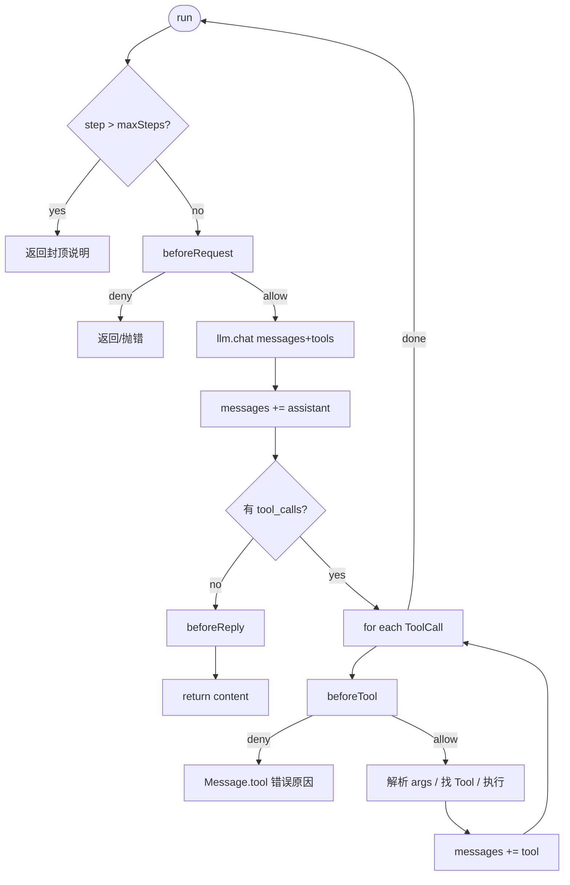

# AgentLoop

> 对齐 [第 2 章](https://bojieli.github.io/ai-agent-book/astro/book/chapter2/) 的 Agent 核心 while 循环（业界常称 ReAct / Agent loop）。
>
> **相关文档**（阅读顺序见 [README.md](./README.md)）  
> · [agent-graph-design.md](./agent-graph-design.md) — 固定编排 / 要点表  
> · [runtime.md](./runtime.md) — Filter / Listener 挂载与时序  
> · [a2a.md](./a2a.md) — A2A（本版存档，不做）

## 0. 和 Graph 怎么共存

**某个 Agent 实例**可以：

| 模式 | 怎么配 | 典型 |
| --- | --- | --- |
| **只用 Graph** | `agent.run(...)`，图里只有 LlmNode / SkillNode… | 订票流水线 |
| **只用 AgentLoop** | `agent.run(...)`，不挂业务 Graph | 开放助手 |
| **Graph 里嵌 AgentLoop** | 图中某步是 `AgentLoopNode`，内部跑同一个 `AgentLoop` | 前半调研、后半固定下单 |

库里两种能力都在；**实例按需选用**，不是每次请求双引擎并行。

命名：实现类叫 **`AgentLoop`**（实现接口 `Loop`）；图上的一步叫 **`AgentLoopNode`**。

---

## 1. 它解决什么

开放规划：开发者提供 **目标** 与 **用户定义的 Tool**；模型借助**极小元工具**按需发现 **Skill / MCP**，再按 **name** 选用已挂载的业务 Tool。

| | 固定 Graph | AgentLoop |
| --- | --- | --- |
| 下一步谁定 | 开发者 | **模型** |
| Skill | `SkillNode` 钉死激活 | `skill_search` → `load_skill`（禁止全量进 prompt） |
| Tool | 可钉死；或随激活挂载 | **用户注册后启动即挂**；LLM 见 name |
| MCP | 可钉死；或随激活挂载 | 按配置名 `mount_mcp`（未 mount 不进 `tools[]`） |
| 典型 | 订票流水线 | 开放助手、调研 |

**总原则：Skill / MCP 按需；Tool 由用户定义。** 本版不做 A2A。

---

## 2. 核心对象

```text
AgentLoop (implements Loop)
  ├── Llm
  ├── SkillRegistry          // list / find；元工具 skill_search 在 AgentLoop 内过滤 list()
  ├── ToolRegistry           // 用户 Tool；run 时挂给 LLM（见 name）
  ├── mounted tools[]        // 元工具 + 用户 Tool + 按需 mount_mcp / skill requires
  ├── Filter / Listener
  └── maxSteps
```

`Graph.run(state, LoopContext)`：Node 执行时用同一个 `LoopContext`（**会话** `id`、**默认** llm、钩子、两个 Registry、Loop、`LoopManager`）。`LlmNode` 可自带 `llm`，覆盖 context 默认。`AgentNode` 经 `LoopManager` 调度子 Agent（独立 `sessionId`）。

```java
public interface Loop {
    String id();  // 会话，默认 UUID；同 Loop 多次 run 不变
    /** 就地追加 assistant / tool 消息；返回最终对用户可见文本。 */
    String run(List<Message> messages, List<Tool> tools);
}
```

- `messages`：调用方持有的可变轨迹。  
- `tools`：入参为**用户定义的业务 Tool**（`Agent.tool` / `AgentLoopNode.tools` / `run(..., tools)`）；运行中再叠加元工具与 `load_skill` / `mount_mcp` 挂上的能力。  
- 返回值：最后一轮无 `tool_calls` 的 assistant `content`（或异常路径：错误给用户并等下一条消息）。

---

## 3. 主循环（完整版）

对齐书中伪代码，并补上生产必需分支：

```text
step = 0
while true:
  step += 1
  if step > maxSteps:
      listener.onError(...)
      追加或返回「达到 maxSteps」说明
      return 说明文本

  fr = filters.beforeRequest(messages)
  if deny: 错误给用户；等待下一条 user message；return

  resp = llm.chat(messages, mountedTools)       // 仅已挂载 tools，禁止全量注册表
  choice = resp.choices.get(0)
  assistant = choice.message
  messages.add(assistant)

  if assistant.toolCalls 为空:
      if content 亦空: 错误给用户（网络/超时等）；等用户；return
      fr = filters.beforeReply(text)
      if deny: 错误给用户；等用户；return
      return text

  for call in assistant.toolCalls:
      fr = filters.beforeTool(call)
      if deny: 错误给用户；等用户；return   // 不静默 continue 给模型吞错

      listener.onToolCall(call)
      if call 是 skill_search / load_skill / mount_mcp:
          按需返回 top-k 或挂载进 mountedTools / 注入 skill 正文
          messages.add(Message.tool(...))
          continue
      tool = findTool(mountedTools, call.name)
      ...

      try:
          args = parseJson(call.args)      // 保真：失败则把解析错误写回 tool 消息
          result = tool.call(args)              // → String 或 ToolResult.text
          // 若 tool 由 Skill 包装：此处才按 name 加载 SKILL.md 再执行
      catch e:
          listener.onError(e)
          result = "Error: " + e.getMessage()

      listener.onToolResult(call.name, result)
      messages.add(Message.tool(call.id, result))

  // 4) 带上 tool 结果再请求模型
```



---

## 4. 轨迹如何增长（书中例子压缩）

**调用前**

```text
system, user
```

**第 1 轮模型要工具**

```text
system, user,
assistant { content: null, tool_calls: [call_1, call_2] }
```

**框架执行后再次请求前**

```text
system, user,
assistant { tool_calls: [...] },          // 原样保留
tool { tool_call_id: call_1, content: "..." },
tool { tool_call_id: call_2, content: "..." }
```

**第 2 轮模型给最终答复**

```text
...同上,
assistant { content: "最终回答", tool_calls: [] }
→ Loop 结束，return content
```

硬性规则（第 2 章）：

1. assistant 的 `tool_calls` **必须原样回灌**，不能丢。
2. tool 结果必须是 `role=tool` + `tool_call_id`，**禁止**塞进 user 文本。
3. 每次请求带上**完整** `messages`；本轮 `mountedTools` = 用户 Tool + 元工具，并可随 skill/MCP mount 增长。

---

## 5. 能力从哪来（Skill / MCP 按需；Tool 用户定义）

| 层 | 是什么 | 进模型视野 |
| --- | --- | --- |
| **Skill** | `SKILL.md` → 具体类 `Skill`（name / description / body / requires） | `skill_search`（top-k 摘要）→ `load_skill`（正文） |
| **Tool** | 用户定义的 bash / excel / … | **`Agent.tool` / `run` 入参启动即挂**；LLM 只见 **name + schema** |
| **MCP** | 远端工具源 | 按配置名 `mount_mcp`；未 mount 前不进 `tools[]` |
| **元工具** | `AgentLoop` 内建普通 `Tool` | 常驻（`skill_search` / `load_skill` / `mount_mcp`） |

```text
启动：元工具 + 用户 Tool
   │
   ├─ 模型 skill_search("天气") → top-k 摘要回灌（给模型看，不替模型选）
   ├─ 模型自己 load_skill("call-weather-api") → 正文 + requires 触发 mount bash
   ├─ 模型自己 mount_mcp("configured-server")（需要时）
   └─ 模型自己 tool_call(用户 Tool 的 name, …) → role=tool 回灌
```

- **选型权在 LLM**：业务 Tool 按 **name** 自选；`skill_search` 只缩短 skill 候选；MCP 按配置名挂载。  
- Skill **不是** Tool；MCP 暴露的能力在挂载后**就是** Tool。  
- 禁止：系统提示塞全量 skill 列表；启动塞全量 MCP tools/list。  
- **无独立 Memory**：工作记忆就是本 Loop 的 `messages`；Graph 跨段用 `state`。  
- A2A：本版不做。

---

## 6. 边界与失败语义

| 情况 | 行为 |
| --- | --- |
| `choices` 为空 | 错误给用户（如网络/超时/调用失败）→ **等下一条 user message**；`onError` |
| `content` 与 `tool_calls` 皆空 | 同上：视为异常空响应，**错误给用户**（提示可能网络不稳、模型超时等）→ **等用户**；打日志 + `onError` |
| 并行多个 `tool_calls` | 语义上独立；实现可先**串行**，文档标明以后可并行 |
| 未知 tool 名 | 写入 `Message.tool` 错误串，**继续循环**（让模型改） |
| `args` JSON 非法 | 错误写入 tool 消息或交给用户（实现可选）；推荐与未知工具一样给模型可见错误时仅限「非 Filter 的执行失败」 |
| `beforeTool` deny | **不执行**；错误原因交给用户；**中止自动推进，等待下一条 user message**（不让模型静默续跑） |
| `beforeRequest` / `beforeReply` deny | 同上：错误给用户 + 等下一条 user message |
| `maxSteps` | 中止；说明给用户；listener.onError；进入「等用户」 |
| 工具执行抛异常 | 捕获 → 错误给用户 → 等用户（由上层决定是否带着上下文再 run） |
| 只有 system、没有 user | **不调模型**；错误给用户 |
| 多轮用户追问 | 用户新 `user` 到达后，再 `agent.run("追问")` 继续 |

---

## 7. Filter / Listener 在 AgentLoop 中的位置

与 [runtime.md](./runtime.md) 一致，强调开放路径：

| 钩子 | 何时 | 阻止时 |
| --- | --- | --- |
| `beforeRequest` | 每次 LLM 调用前 | 错误给用户 → **等下一条 user message** |
| `onToken` / `onStatus` / … | 展示 | —（Listener 不拦截） |
| `beforeTool` | 每个 Tool/Skill 执行前 | 不执行；错误给用户 → **等用户** |
| `onToolCall` / `onToolResult` | 执行前后 | — |
| `beforeReply` | 最终文本返回前 | 错误给用户 → **等用户** |
| `onError` | 异常 / maxSteps 等 | 配合展示 |

**统一规则：** Filter deny、以及模型空响应/空 choices 等不可继续的异常，一律 = **对人可见的错误 + 暂停自动循环，等人说话**；不是「返回空串结束」也不是「塞给模型继续想」。

`beforeRequest` 参数为 `List<Message>`，与真实请求对齐。

---

## 8. 三种用户入口

### 8.1 直接使用 Loop

```java
Loop loop = new AgentLoop(llm, 20).filter(audit).listener(ui);
List<Message> messages = new ArrayList<>();
messages.add(Message.system("..."));
messages.add(Message.user("..."));
String answer = loop.run(messages, tools);
// messages 已含完整轨迹，可持久化或继续追问
messages.add(Message.user("那东京呢？"));
answer = loop.run(messages, tools);
```

### 8.2 Agent.run（唯一入口；纯 Loop 会话）

```java
Agent agent = Agent.builder()
    .llm(llm)
    .tools(tools)
    .loop(new AgentLoop(llm))   // 无 Graph → run 走 AgentLoop
    .system("...")              // 配置；不是一轮，不在 build 时入列
    .filter(audit)
    .listener(ui)
    .build();

agent.run("第一问");            // 追加 user；必要时再写入 system，然后 loop.run
agent.run("追问");              // 再追加一条 user
List<Message> transcript = agent.messages();
```

- **唯一入口 `agent.run(...)`**：有 Graph → 固定编排；无 Graph 仅 Loop → 开放会话。  
- `run(String)` **只表示用户轮**。只有 system、没有 user 时 **不调模型**。  
- 不单独提供 `chat`。

### 8.3 AgentLoopNode（Graph 中的开放一步）

```java
AgentLoopNode.builder("research")
    .loop(loop)                 // 可共享 Agent 级 Loop 配置
    .tools(researchTools)       // 本节点可见工具 ⊂ 或独立名单
    .system("只负责调研，不要下单")
    .inputKey("topic")          // state → 本轮 user 内容
    .outputKey("notes")         // 最终 content → state
    .maxSteps(10)
    .build();
```

执行语义：

1. 从 state 取 input，构造**局部** `messages`（可注入短 system）。
2. **默认不继承**上一段 AgentLoop 的轨迹（隔离）；若设置 **`inheritMessages(true)`**，则把指定前序 messages 并入本段起点。
3. 跨段常规做法：上一段把结论写入 `state`，本段 system/user 只注入摘要——不必继承整段 tool 轨迹。
4. `loop.run(localMessages, nodeTools)`。
5. 最终文本写入 `state[outputKey]`；可选把局部轨迹写入 `state[name + ".messages"]` 便于调试。

---

## 9. 与 LlmNode / SkillNode 的分工（防混用）

| 能力 | LlmNode | SkillNode | AgentLoop / AgentLoopNode |
| --- | --- | --- | --- |
| 调 LLM | **至多一轮** | 否（仅激活说明书） | **多轮 until 结束** |
| 请求带 `tools` | 默认否；可选极小白名单 | 激活时按 `requires` 挂载 | **元工具 + 用户 Tool + 按需 MCP/skill mount** |
| 模型选工具并循环 | **否** | 否 | **是** |
| 激活 skill | 否 | 是（名钉死，跳过 search） | 是（`skill_search` + `load_skill`） |

错误示范：在 `LlmNode` 上挂全量 tools「顺便开放」。  
正确做法：多轮开放用 `AgentLoopNode`；单轮对话/抽取用 `LlmNode`；固定激活某说明书用 `SkillNode`。

---

## 10. Llm 为 AgentLoop 必须具备的能力

```java
public interface Llm {
    LlmResp chat(List<Message> messages);
    LlmResp chat(List<Message> messages, List<Tool> tools);
}

// LlmClient implements Llm（HTTP chat/completions）
// LlmResp { List<Choice> choices; }
// Choice  { int index; Message message; String finishReason; }
```

序列化 messages 时：

- assistant + toolCalls → JSON `tool_calls`
- tool + toolCallId → JSON `tool_call_id`
- tools → OpenAI function 形态（name/description/parameters）

可不做 stream；预留 `stream(..., Consumer<String>)` 与 `Listener.onToken`。

---

## 11. 本版不做

- 并行 tool 执行的线程池（先串行）
- 自动上下文压缩 / 摘要（过长时以后再做；本版整段 `messages` 原样带上）
- 独立 `Memory` 模块 / 跨会话记忆检索
- 多 Candidate（只用 `choices.get(0)`）
- HITL 暂停（Filter deny → 错误给用户并等下一条 user message）
- A2A / 调其他 Agent

Skill **按需**（`skill_search` / `load_skill`）；MCP 按配置名 `mount_mcp`；业务 Tool **用户定义**；`FileSkillRegistry.install(Path)`；单次 run 内可扩展已挂载 tools。

---

## 12. 验收标准

实现完成时，至少能演示：

1. `skill_search` → `load_skill` → 挂载 `bash` → curl 成功（系统提示**无**全量 skill 列表）。  
2. Excel 类 skill → 挂载 excel Tool（而非只用 bash）。  
3. MCP：未 mount 前其 tool 不在 `tools[]`；mount 后方可调用。  
4. 启动 `tools[]` = 元工具 + **用户注册的 Tool**。  
5. Filter deny / 空响应 → 错误给用户并等下一条 user message；`maxSteps`、追问、`AgentLoopNode` state 正确。

---

## 13. 要点

- 实现类命名：**`AgentLoop`**（图上一步：**`AgentLoopNode`**）
- Agent 实例：可只用 Graph、只用 AgentLoop，或 Graph 嵌 AgentLoop
- **LlmNode vs AgentLoopNode**：LlmNode 至多一轮（默认无 tool，可选极小白名单）；多轮自选工具直到说完 → 必须 AgentLoopNode
- AgentLoop：Skill / MCP **按需**；Tool **用户定义、LLM 按 name 自选**；**不做 A2A**
- Skill：具体类 `Skill`；`FileSkillRegistry` 深层 walk + 可选 overlay；`skill_search` → `load_skill`；执行靠模型选 Tool
- Tool / MCP：Tool 用户注册启动即见；MCP：按配置名 `mount_mcp`
- A2A：本版不做（见 [a2a.md](./a2a.md) 存档）
- `LlmResp` = `List<Choice>`
- Graph 出边不匹配 → 抛错；有环 → 抛错
- Graph：匹配出边全部激活（fan-out）；互斥分支用互斥 `Edge.when`；并行经 `LoopManager`
- 唯一入口 **`agent.run`**；每个 Loop 一个 `sessionId`（默认 UUID，追问不换）
- 另一 Agent：`AgentNode` → `LoopManager` 虚拟线程池 + 独立 sessionId
- Filter deny → 错误给用户 + 等待下一条 user message（`beforeRequest` / `beforeTool` / `beforeReply`）
- `beforeRequest(List<Message>)`
- Filter/Listener **只挂 Agent**
- Skill/Tool 激活与调用 → **`beforeTool`**
- UI → **Listener 收口**
- 多 AgentLoopNode messages：默认隔离 + `inheritMessages` + state 跨段
- 空 content / 空 choices → **错误给用户** + **等下一条 user message**
- Skill 发现：`skill_search`（按需）；不作系统提示全量列表
- **LLM 自己选 skill、自己选 tool（按 name）**；`skill_search` 只给 skill 候选；MCP 按配置名 `mount_mcp`
- **无独立 Memory**：`messages` = 会话工作记忆；`state` = Graph 草稿

---

## 文档索引

| 文档 | 内容 | 本版 |
| --- | --- | --- |
| [README.md](./README.md) | 总目录与阅读顺序 | — |
| [agent-graph-design.md](./agent-graph-design.md) | Agent / Graph / Skill / 边界类型 / 订票示例 | ✅ |
| [runtime.md](./runtime.md) | Graph vs Loop、Filter / Listener 挂载点 | ✅ |
| [agent-loop.md](./agent-loop.md) | AgentLoop（本文） | ✅ |
| [a2a.md](./a2a.md) | A2A 与 Rove 映射 | 📦 存档 |