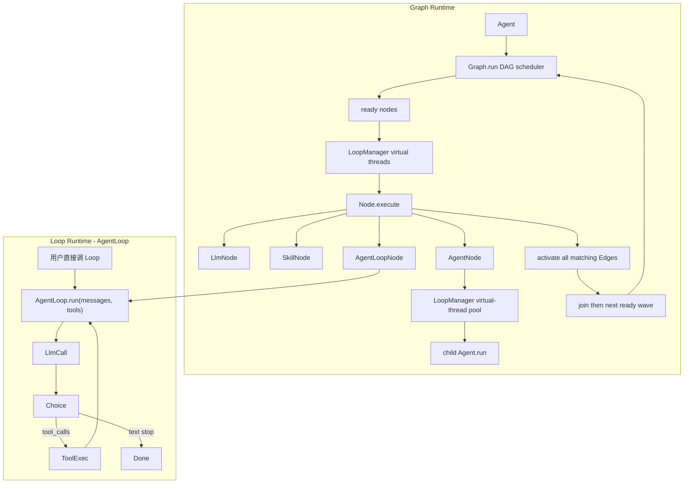
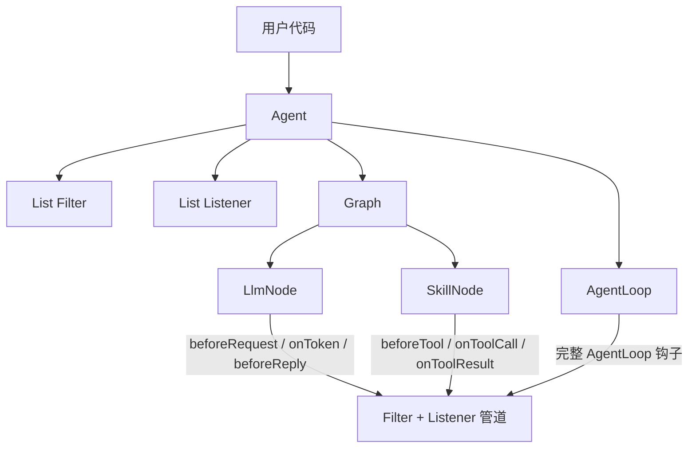

# Rove 运行时

> 运行时怎么跑、用户在哪挂 `Filter` / `Listener`、`Loop` 处在什么位置。
>
> **相关文档**（阅读顺序见 [README.md](./README.md)）  
> · [agent-graph-design.md](./agent-graph-design.md) — Agent / Graph / Skill  
> · [agent-loop.md](./agent-loop.md) — AgentLoop（主循环 / 失败 / 验收）  
> · [a2a.md](./a2a.md) — A2A（本版存档，不做）

## 两种运行时路径

| 路径 | 谁驱动下一步 | 典型场景 |
| --- | --- | --- |
| **Graph 运行时** | DAG：Node + Edge；匹配边 fan-out / 互斥 when 分支；就绪节点并行 | 订机票、审批 |
| **Loop 运行时（AgentLoop）** | LLM 通过 `tool_calls` 自己规划 | 开放探索、「自己看着办」 |

两条路径都做，共用 `Message` / `Tool` / `Choice` / Filter / Listener；差别只在「下一步谁说了算」。



- **Graph**：DAG 调度——多就绪节点并行、下游 join；步骤与 Skill **不由模型决定**（`LlmNode` / `SkillNode`）。互斥分支靠互斥 `Edge.when`；多条同时匹配的出边是 fan-out。
- **Loop（开放规划（AgentLoop））**：第 2 章 while 循环——有 `tool_calls` 就执行再请求，否则结束。
- **结合**：Graph 里某一步放 `AgentLoopNode`，只在这一步放开规划；前后仍是固定边。

---

## 开放规划（AgentLoop）怎么做

> 以下为摘要。算法、轨迹、失败表、验收标准等完整内容见 **[agent-loop.md](./agent-loop.md)**。

### 内核：`AgentLoop implements Loop`

对齐第 2 章伪代码，职责单一：

```java
public final class AgentLoop implements Loop {
    private final Llm llm;
    private final List<Filter> filters;
    private final List<Listener> listeners;
    private final int maxSteps;
    private SkillRegistry skills;
    private ToolRegistry toolRegistry;

    @Override
    public String run(List<Message> messages, List<Tool> tools) {
        // while: beforeRequest → llm.chat(messages, mounted) → Choice
        //   no tool_calls → beforeReply → return content（空则 log + 错误给用户）
        //   each ToolCall: beforeTool → call → onToolResult → Message.tool
    }
}
```

代码现状：

1. `Llm` / `LlmClient`：请求带已挂载 `tools`，响应 `LlmResp` → `Choice`（含 `tool_calls`）
2. `ToolCall.args` 为原始 JSON 字符串（协议字段仍为 `arguments`）
3. Filter / Listener **只挂在 Agent**，经 **`LoopContext`** 传到 Graph / AgentLoop

### 用户怎么用：三种入口

**① 纯开放 Agent（只有 Loop，无 Graph）**

```java
List<Tool> tools = List.of(shell, webSearch /* 或从 SkillRegistry 转成 Tool */);
Loop loop = new AgentLoop(llm).filter(audit).listener(ui);

List<Message> ctx = new ArrayList<>();
ctx.add(Message.system("你是助手，可使用提供的工具完成任务。"));
ctx.add(Message.user("看看仓库里有没有 README，总结一下"));

String reply = loop.run(ctx, tools);  // ctx 内追加 assistant / tool 消息
```

**② 挂在 Agent 上（默认跑 Loop）**

```java
Agent agent = Agent.builder()
    .name("explorer")
    .llm(llm)
    .tools(tools)              // 开放给模型的工具清单
    .loop(new AgentLoop(llm))  // 默认实现
    .filter(audit)
    .listener(ui)
    .build();

String reply = agent.run("帮我查一下…");  // 用户轮 → 无 Graph 则 loop.run
```

**③ 固定编排里嵌一段开放规划（`AgentLoopNode`）**

订票仍用 SkillNode 钉死；但「调研竞品」这种不确定步骤用 AgentLoop：

```java
Node research = AgentLoopNode.builder("research")
    .loop(new AgentLoop(llm))
    .tools(researchTools)     // 仅这一步可见的工具，不是全局乱挂
    .inputKey("topic")
    .outputKey("notes")
    .build();

graph.addEdge(research, writeReport);  // writeReport 可以是普通 LlmNode
```

要点：

| 节点 | 模型能否自己选 tool |
| --- | --- |
| `LlmNode` | **否**（不传 tools） |
| `SkillNode` | **否**（开发者绑死 skill 名） |
| `AgentLoopNode` / 纯 `Loop` | **能**（仅限你传入的 `tools` 列表） |

开放规划（AgentLoop） **不是**让 `LlmNode` 偷偷带上全部 skill；而是**显式**走 `Loop` / `AgentLoopNode`。

### Skill 与开放规划（AgentLoop） 的衔接

- **安装**：全局或当前 Agent；同名 **Agent 覆盖全局**；只进侧车索引。
- **Skill / MCP 按需**：`skill_search` / `load_skill`；MCP 按配置名 `mount_mcp`；禁止全量 skill / MCP tools 进 system / `tools[]`。
- **Tool**：用户 `Agent.tool` / `ToolRegistry` 注册后**启动即挂载**；LLM 只见这些 name。
- **激活**：`load_skill` / `SkillNode` → 正文；`requires` → 从 Registry 挂载对应 Tool。
- **执行**：模型对已挂载 Tool（含 MCP tool）发 `tool_call`。
- 常驻：**元工具**（`skill_search` / `load_skill` / `mount_mcp`）+ **用户业务 Tool**。

### 安全（开放路径必做的最小集）

1. `maxSteps`：超过则停；说明给用户并等下一条消息。
2. Filter.`beforeTool`：含 skill/MCP 元工具与业务调用；deny → 错误给用户并等用户。
3. 未加载的 Skill 正文 / 未 mount 的 MCP tools **对模型不可见**；用户未注册的 Tool 亦不可见。

---

## 现有接口（`rove-core`）

### Loop

```java
// rove-core/.../loop/Loop.java
String run(List<Message> messages, List<Tool> tools);
```

- 含义：一次 **AgentLoop 循环入口**（messages 会增长；tools 为已挂载集合）。
- 实现：`AgentLoop`。
- **Graph 结合**：`AgentLoopNode` 内部调用同一个 `Loop`。
- **`LlmNode` 不实现 Loop**：它只做单次无 tools 的 chat。

### Filter（门禁，可拦截）

```java
FilterResult beforeRequest(List<Message> messages);
FilterResult beforeTool(ToolCall call);
FilterResult beforeReply(String reply);
```

- `FilterResult.allow()` / `deny(reason)`：`allowed == false` 则**阻断**该动作。
- 适合：权限、敏感词、危险命令、合规审计（对应书中执行层护栏，偏「能不能做」）。

### Listener（旁路观察 + UI 收口，不改控制流）

```java
void onToken(String token);                 // 流式吐字 → 聊天区
void onStatus(String status);               // 状态栏文案，如「正在调用 check-tickets…」
void onNodeStart(String nodeName);          // Graph 步开始（可选但建议有，方便状态栏）
void onNodeEnd(String nodeName);            // Graph 步结束
void onToolCall(ToolCall call);
void onToolResult(String toolName, String result);
void onError(Throwable error);
```

- **用户可见的动态**（状态栏、蹦出来的 token、当前在跑哪一步/哪个工具）**都经 Listener**，不要另开一套 UI 回调。
- Filter 管「能不能做」；Listener 管「给人看什么」。

---

## 用户在哪里挂 Filter / Listener

原则：**挂在「会真正发起副作用」的运行时入口上**，而不是散落在每个业务 Node 里手写一遍。

### 推荐挂载点

| 挂载处 | 作用域 |
| --- | --- |
| **`Agent`** | 一次 `agent.run` / 整次会话（**只挂这里**，向下传到 Graph / AgentLoop） |



### 用户代码示例

```java
Filter audit = new Filter() {
    @Override
    public FilterResult beforeTool(ToolCall call) {
        if (call.name().contains("book") && !isUserConfirmed()) {
            return FilterResult.deny("订票前需用户确认");
        }
        return FilterResult.allow();
    }
};

Listener ui = new Listener() {
    @Override public void onToken(String token) { System.out.print(token); }
    @Override public void onToolCall(ToolCall call) {
        System.out.println("\n>> tool " + call.name());
    }
    @Override public void onToolResult(String name, String result) {
        System.out.println("<< " + name + " done");
    }
    @Override public void onError(Throwable e) {
        System.err.println("error: " + e.getMessage());
    }
};

Agent agent = Agent.builder()
    .name("flight-booking")
    .llm(llm)
    .skills(skills)
    .graph(graph)
    .filter(audit)       // 可多次 .filter(...)
    .listener(ui)        // 可多次 .listener(...)
    .build();

agent.run(input);
```

开放规划：

```java
Loop loop = new AgentLoop(llm)
    .filter(audit)
    .listener(ui);

String reply = loop.run(messages, tools);
```

**同一套 Filter/Listener 接口**，Graph 与 Loop 两套运行时复用；不要各造一套回调。

---

## Graph 运行时：钩子打在哪一步

一次 `Graph.run(state, LoopContext)`（DAG 调度）：

```text
detect cycle → 有环则抛错
state = synchronizedMap(input)
reachable = {所有入度为 0 的节点}   // 多起点；多汇点自然结束各自路径
completed = {}
loop:
  ready = reachable \ completed 中「所有可达前驱已完成」的节点
  if ready 空 → 结束（若仍有未完成可达节点 → 抛错；结果为共享 state）
  并行（|ready|>1 时经 LoopManager 虚拟线程；单个可本线程）:
    Listener.onNodeStart(name)
    if node is LlmNode:
        ctx.beforeRequest(messages)
        listener：流式 onToken（若 stream）
        resp = llm.chat(messages)           // 节点自带 Llm，否则 ctx.llm()
        filter.beforeReply(content)
        写回 state / messages
    if node is SkillNode:
        解析 skill → 得到等价 ToolCall 或直接 Tool.call
        filter.beforeTool(toolCall)
        listener.onToolCall(...)
        result = activate skill and/or Tool.call
        listener.onToolResult(...)
        写回 state
    if node is AgentNode:
        LoopManager.call(() -> child.agent.run(...))
        写回 outputKey / name.sessionId
    Listener.onNodeEnd(name)
    // —— 出边：所有 matches(state) 的目标进入 reachable（fan-out）——
    if 有出边但都不匹配 → **抛错**
  join 本波全部完成后进入下一波
```

说明：

1. **`beforeTool`** 覆盖：`load_skill`、`mount_mcp`、以及 bash/excel 等业务 Tool。SkillNode 激活也构造成可拦截的 `ToolCall`（少加接口）。
2. **`beforeRequest` / `beforeReply`** 主要打在 `LlmNode`。
3. **Edge.condition 不是 Filter**：condition 控制边是否激活；Filter 是安全/合规门禁。互斥分支用互斥 `when`；并行用多条同时匹配的边。
4. **并行与 state**：并行节点应写不同 key；共享 `state` 已 synchronized。

---

## Loop 运行时：钩子打在哪一步

对齐第 2 章 while 循环：

```text
messages = ...
while true:
  filter.beforeRequest(...)
  resp = llm.chat(messages, tools) → Choice
  assistant = choice.message
  messages += assistant

  if assistant.toolCalls 为空:
      filter.beforeReply(content)
      return content

  for call in assistant.toolCalls:
      filter.beforeTool(call)            // deny → 可写入错误 tool 消息或中止
      listener.onToolCall(call)
      result = tools[call.name].call(...)
      listener.onToolResult(...)
      messages += Message.tool(call.id, result.text)
```

`Loop` 是 **开放规划运行时的内核**；Graph 的 `AgentLoopNode`（若有）只是把这段循环嵌进图里的一步。

---

## Filter vs Edge.condition vs Listener

| 机制 | 能否改控制流 | 典型用途 |
| --- | --- | --- |
| **Edge.condition** | 是（是否激活该业务边；多条同时匹配 = fan-out） | 有票 → book；无票 → noTicket（互斥 when） |
| **Filter** | 是（阻断当前动作） | 未授权禁止订票；拦截危险命令 |
| **Listener** | 否 | 日志、UI、metrics |

不要用 Listener 做权限；不要用 Filter 表达「有没有票」这种业务分支。

---

## Agent 运行时职责（汇总）

```java
Agent.builder()
    .graph(graph)                 // 可选；无 Graph 则 run(String) 走 AgentLoop
    .loop(new AgentLoop(llm))     // 可选
    .skills(registry)
    .toolRegistry(tools)
    .llm(client)
    .filter(...)
    .listener(...)
    .build();

agent.run("帮我查一下…");
agent.run(state);
```

Filter / Listener 只配在 Agent 上，执行时打进 `LoopContext`。


---

## 与现有包结构的对应

| 包 | 运行时角色 |
| --- | --- |
| `agent.Agent` | 唯一入口 `run` |
| `loop.Loop` / `AgentLoop` | 开放规划 |
| `loop.LoopContext` | 会话 `id` + 默认 llm / Filter / Listener / Registry / `LoopManager` |
| `loop.LoopManager` | 虚拟线程池；嵌套 Agent 调度 |
| `loop.Filter` / `FilterResult` | 门禁 |
| `loop.Listener` | 可观测（slf4j 打运行日志；Listener 给人看） |
| `graph.Graph` / `Node` / `Edge` / `LlmNode` / `SkillNode` / `AgentLoopNode` / `AgentNode` | 固定编排 |
| `llm.Llm` / `LlmClient` / `LlmResp` / `Choice` | 模型调用 |
| `tool.Tool` / `ToolRegistry` / `ToolCall` / `BashTool` | 用户定义工具；`ToolRegistry` 仅 `register` / `get` / `list`；可选内置 `BashTool`（本机 bash）；元工具由 `AgentLoop` 内建（`skill_search` / `load_skill` / `mount_mcp`） |
| `skills.Skill` / `SkillRegistry` / `FileSkillRegistry` | Skill 安装与查找（`list` / `find` / `install`；无 registry `search`） |
| `mcp.McpClient` | MCP（按需 mount） |

命名上 `Filter`/`Listener` 现挂在 `loop` 包：即使 Graph 也会用它们。可视为运行时横切能力。

---

## 文档索引

| 文档 | 内容 | 本版 |
| --- | --- | --- |
| [README.md](./README.md) | 总目录与阅读顺序 | — |
| [agent-graph-design.md](./agent-graph-design.md) | Agent / Graph / Skill / 边界类型 / 订票示例 | ✅ |
| [runtime.md](./runtime.md) | Graph vs Loop、Filter / Listener（本文） | ✅ |
| [agent-loop.md](./agent-loop.md) | AgentLoop | ✅ |
| [a2a.md](./a2a.md) | A2A 与 Rove 映射 | 📦 存档 |
